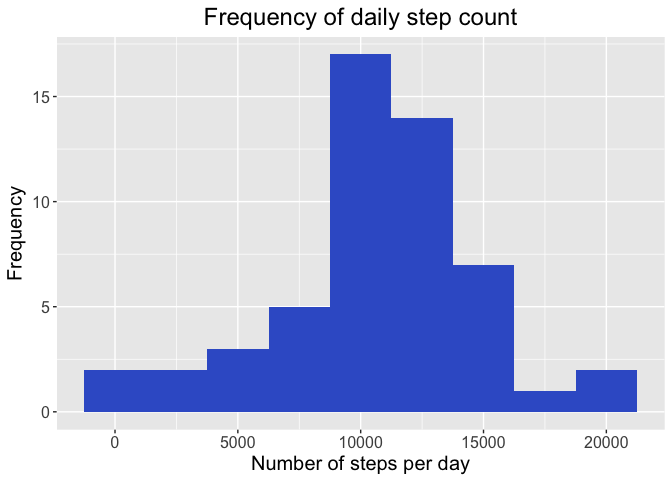
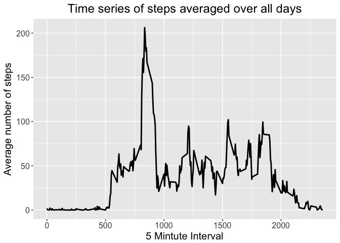
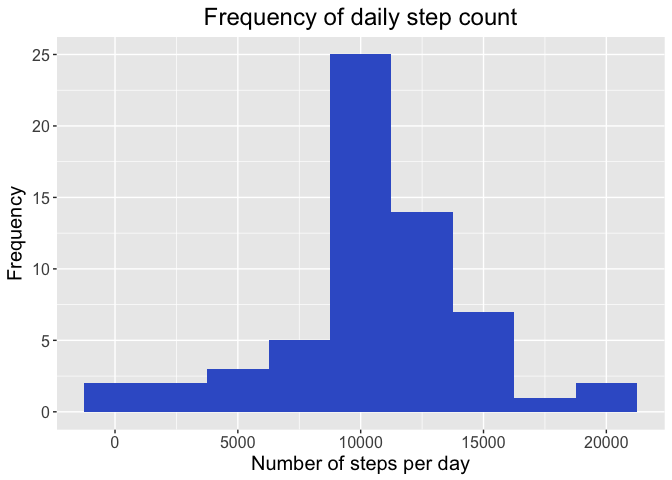
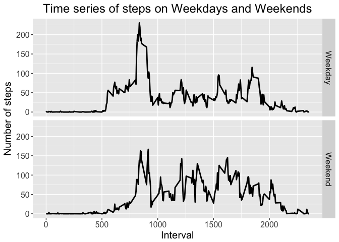

# Reproducible Research: Peer Assessment 1


## Loading and preprocessing the data
First we unzip and read in the data

```r
unzip("activity.zip")
activity <- read.csv("activity.csv")
```

## What is mean total number of steps taken per day?
First we need to convert the date column into Date format

```r
activity$date <- as.Date(activity$date,"%Y-%m-%d")
```

Then we group by day and sum the number of steps  
Here I use the dplyr package  
I also make sure to filter out the NAs

```r
library(dplyr)
stepbyday <- activity %>%
  filter(!is.na(steps)) %>%
  group_by(date) %>%
  summarize(nsteps = sum(steps))
```

Now we have the data in a form to plot a histogram

```r
library(ggplot2)
ggplot(stepbyday, aes(nsteps))+geom_histogram(binwidth=2500,fill="royalblue3")+
    labs(x="Number of steps per day",y="Frequency",
         title="Frequency of daily step count")+
    theme(text = element_text(size=15),plot.title = element_text(hjust = 0.5))
```

<!-- -->

Now we calculate the mean and median number of steps taken


```r
stepmean <- mean(stepbyday$nsteps)
stepmedian <- median(stepbyday$nsteps)
```

The mean step count is 1.0766189\times 10^{4} and the median step count is 10765

## What is the average daily activity pattern?
To create a time series averaged over all days, first group by interval, then
average over all the days


```r
stepbyint <- activity %>%
    filter(!is.na(steps)) %>%
    group_by(interval) %>%
    summarize(nsteps = mean(steps))
```

Then plot the time series

```r
ggplot(stepbyint, aes(x=interval,y=nsteps)) + geom_line(lwd=1)+
    labs(x="5 Mintute Interval",y="Average number of steps",
         title="Time series of steps averaged over all days")+
    theme(text = element_text(size=15),plot.title = element_text(hjust = 0.5))
```

<!-- -->

Now find the interval that contains the maximum number of steps


```r
stepbyint$interval[which.max(stepbyint$nsteps)]
```

```
## [1] 835
```

## Imputing missing values
Find the number of rows with missing values


```r
sum(is.na(activity$steps))
```

```
## [1] 2304
```

Fill in the missing values by replacing them with the average for that interval


```r
for (i in 1:length(activity$steps)){
    if (is.na(activity$steps[i])){
        index <- which(stepbyint$interval == activity$interval[i])
        activity$steps[i]<-stepbyint$nsteps[index]
    }
}
```

Now we can replot the histogram to see if anything has changed

```r
stepbyday2 <- activity %>%
    group_by(date) %>%
    summarize(nsteps = sum(steps))

ggplot(stepbyday2, aes(nsteps))+geom_histogram(binwidth=2500,fill="royalblue3")+
    labs(x="Number of steps per day",y="Frequency",
         title="Frequency of daily step count")+
    theme(text = element_text(size=15),plot.title = element_text(hjust = 0.5))
```

<!-- -->

What are the mean and median values?

```r
mean(stepbyday2$nsteps)
```

```
## [1] 10766.19
```


```r
median(stepbyday2$nsteps)
```

```
## [1] 10766.19
```

## Are there differences in activity patterns between weekdays and weekends?
First we use the weekdays() function to determine the days of the week for each date in the dataset

```r
wkdays <- weekdays(activity$date)
```

Then we have to convert this to Weekdays/Weekends format

```r
for (i in 1:length(wkdays)){
    if (wkdays[i]=="Saturday" | wkdays[i]=="Sunday") {
        wkdays[i]<-"Weekend"
    } else {
        wkdays[i]<-"Weekday"
    }
}
```

And finally, we create a factor variable in activity that contains the Weekday/Weekend information

```r
activity$weekday <- factor(wkdays)
```

Next we group by weekend/weekday and interval, then average the number of steps

```r
stepbywkday <- activity %>%
    group_by(interval,weekday) %>%
    summarize(nsteps = mean(steps))
```

And finally, we plot:

```r
ggplot(stepbywkday, aes(x=interval,y=nsteps))+geom_line(lwd=1)+
    facet_grid(weekday~.)+
    labs(x="Interval",y="Number of steps",
         title="Time series of steps on Weekdays and Weekends")+
    theme(text = element_text(size=15),plot.title = element_text(hjust = 0.5))
```

<!-- -->
